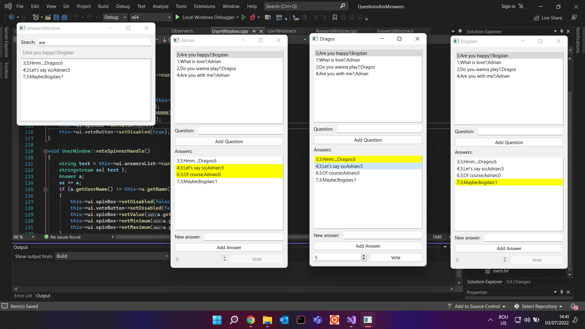

## Questions and Answers - Observer Pattern

### An application which simulates a questions and answers site (like Stack Overflow):

 - The information about all the users is in a text file. Each user has an unique name. 
 - Another file contains information about the questions and answers that already exists on the site. Each question has an id, a text describing the question and the name of the user who asked it. Each answer has its own id, the id of the associated question, the name of the user who answered, the text of the answer and the number of votes.
 - A new window is created for each user, having as title the user's name. The window will show a list of all questions asked so far, sorted descending by the number of answers.
 - Another window will allow any user to search for a question: as the user types, the results are being shown. The best matching question with its top 3 answers will be shown.
 - Any user can add a new question by inputting the question's text. 
 - When a question is clicked, all the answers are shown in another list. The answers given by the current user will be shown with yellow background.
 - Any user can add a new answer to the selected question.
 - A user can upvote or downvote a selected answer.
 - When a modification is made by any user, all the others users will see the modified list of questions and answers.
 - All changes are saved to the file.

#### Observer Pattern
   
   

## Code Example

```c++
class Observer
{
public:
	virtual void update() = 0;

	virtual ~Observer() {}
};

class Subject
{
private:
	std::vector<Observer*> observers;

public:
	void addObserver(Observer* o)
	{
		this->observers.push_back(o);
	}

	void removeObserver(Observer* o)
	{
		auto it = std::find(this->observers.begin(), this->observers.end(), o);
		if (it != this->observers.end())
			this->observers.erase(it);
	}

	void notify()
	{
		for (auto o : this->observers)
			o->update();
	}
};
```

#### Application Preview
   