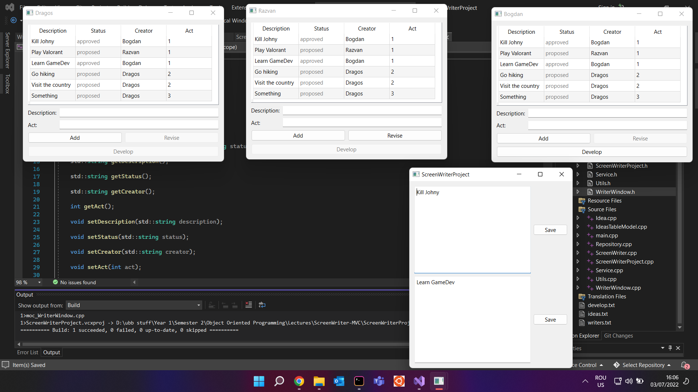

## Screen Writer - Model View Controller Architecture

### Simulates the writing of a television episodes by professionals screenwriters:
 - the information about the screenwriters is in a text file. Each writer has a name and his/her expertise
 - another file contains information about the ideas that were proposed by the writers. Each idea has a description, a status (can be proposed or accepted), the creator (the name of the writer) and the act (1, 2 or 3)
 - when the application starts, a new window is created for each writer. The window will show all the ideas launched so far, sorted ascending by act
 - any writer can add a new idea
 - senior writers can revise ideas and accept them
 - when a modification is made by the user, all the other users will see the modification in the list of ideas
 - each writer can develop its ideas and save them to an associated file

 

#### Model View Controller Architecture 
   

#### Application Preview
   